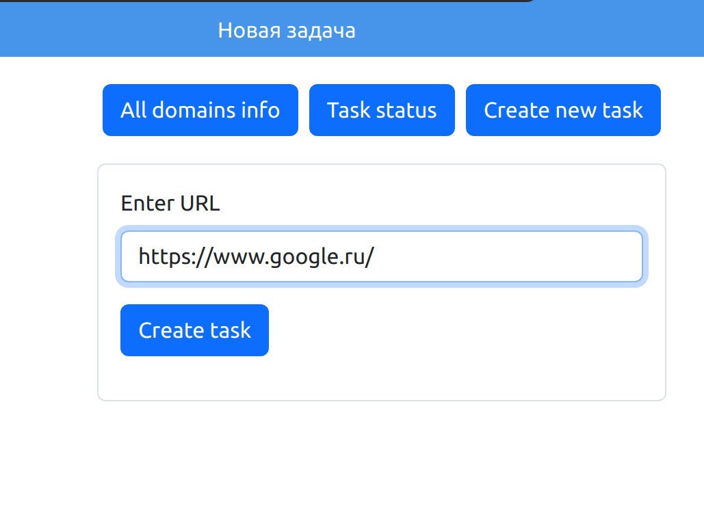
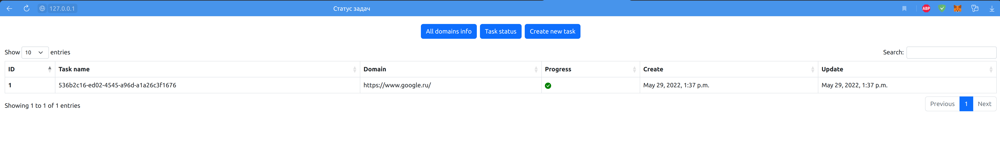
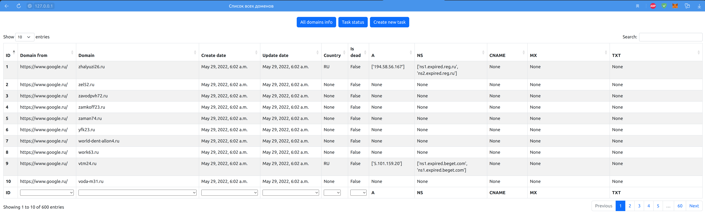

# Parser_web_app_django
## Веб приложение для парсинга web страницы по всем тегам 'a' с атрибутом href


Это тестовое задание от компании "Пикассо"
***

Стек технологий
- Python 3.10.4
- Django 4.0.4
- Celery 5.2.6
- Redis 4.3.1
- Nginx 1.22.0
- PostgreSQL 14.3
- Docker 20.10.16
- Docker-compose 1.29.2
- ✨Магия✨
- ✊Терпение✊
***

Это приложение раскладывает данный адрес на HTML разметку, достает все теги а
с атрибутом href, проходиться по всем этим ссылкам и открывает их через API
https://api.domainsdb.info/v1/domains/search?domain=. Каждое отрытие ссылки 
через этот API, производиться по очередно, в то время как создание задачи 
происходит асинхронно, т.е. параллельно друг другу могут выполняться 
неограниченное кол-во задач. **(запускать 100 задач одновременно на свой страх и риск!)**

***

## Установка

Скопируйте репозиторий себе на компьютер
``` commandline
git clone https://github.com/Lookin44/Parser_web_app_django.git
```

Перейдите в скачанный репозиторий и отредактируйте файл *.env.example*
```dotenv
# Database settings
DB_USER=... # Название пользователя базы данных
DB_PASSWORD=... # Пароль для базы данных
DB_NAME=... # Название базы данных

# Django settings
SECRET_KEY=... # Придумайте сектретный ключ для приложения Django (Я использую метод token_hex(16) встроенной бибилотеки secrets)
```

Переименуйте этот файл в *.env*.

Запустите docker-compose
```shell
docker-compose up #Если Вы не хотите наблюдать за логами, то запустите с параметром -d: docker-compose up -d
```

Дождитесь окончания запуска, и ВУАЛЯ, у Вас запущено приложение для парсинга)
***

## Работа с приложением

После запуска приложения пройдите на адрес: http://127.0.0.1/new_task/

Вы попадете на страницу, откуда все начинается



Передайте в форму адрес и нажмите "Create task"
Если Вы передали верный адрес (принимаются полные адреса: https://yandex.ru/ или http://konvut.github.io)
то задача начнет выполняться, ее состояние можно отследить на странице http://127.0.0.1/check_task/


При этом Вы можете создать еще задачи, они будут выполняться параллельно друг другу.
По завершению задачи ее статус измениться на ✅ - это означает что все ссылки были
открыты через API и информация о них добавлена в базу данных



И последняя страница проекта, конечно же таблица со всеми ссылками http://127.0.0.1


 Таблица пагинируется, сортируется, фильтруется. Элементы сортировки находятся верхней части таблицы,
фильтрация по столбцам внизу таблицы.

***
## Благодарности

- Огромное благодарность моей жене, без ее поддержки у меня ничего не получилось бы)
- [Станиславу Воронову](https://github.com/Stevinel): он выступал в роли тестера, спасибо бро)
- Информационным ресурсам https://habr.com/ и https://stackoverflow.com/ - если на них нет ответа на нужный вопрос,
то наверное Вы двигаетесь не в том направлении)
